# OneDriveReadWriteByBlazorWasm

Blazor WebAssemblyとMicrosoft GraphでOneDriveを読み書きする

## 概要

以下を読みながら、`Blazor WebAssembly`と`Microsoft Graph API`でOneDriveの読み書きを試したときのメモを公開する。

- microsoftgraph/msgraph-sdk-dotnet  
  https://github.com/microsoftgraph/msgraph-sdk-dotnet
- Secure an ASP.NET Core Blazor WebAssembly standalone app with Microsoft Accounts
  https://docs.microsoft.com/en-us/aspnet/core/blazor/security/webassembly/standalone-with-microsoft-accounts?view=aspnetcore-6.0
- Use Graph API with ASP.NET Core Blazor WebAssembly  
  https://docs.microsoft.com/en-us/aspnet/core/blazor/security/webassembly/graph-api?view=aspnetcore-6.0
- List available drives  
  https://docs.microsoft.com/en-us/graph/api/drive-list?view=graph-rest-1.0&tabs=http

より良いやり方や、コード・文章の書きっぷり、やってみたけど動かないとかのフィードバックは、大歓迎。  
たくさんコメントをもらえたら本望。

できたものは以下に置いた。

- https://github.com/rhirano0715/OneDriveReadWriteByBlazorWasm

開発環境構築方法は割愛する。
Visual Studio 2022でBlazor WebAssemblyの開発ができる状態であれば、大丈夫なはず。

ざっくりな流れは、以下のとおり。

1. Azure Active Directoryにアプリを登録する
1. Blazor WebAssemblyを実装する

## Azure Active Directoryにアプリを登録する

Azure Active Directoryにアプリを登録する必要がある。

1. 以下にアクセスする。  
  https://aad.portal.azure.com/#blade/Microsoft_AAD_IAM/ActiveDirectoryMenuBlade/Overview
1. [追加] -> [アプリの登録]をクリックする。  
  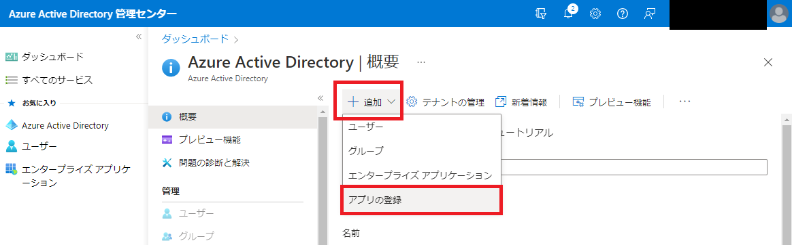
1. 各種入力をして、登録をクリックする。  
   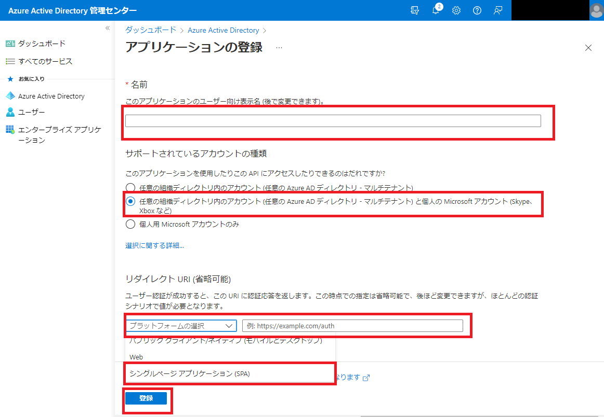  
   1. 名前  
      任意の名前。BlazorWebAssemblyTrialとした。
   1. サポートされているアカウントの種類
1. 表示されているページのURLとクライアントIDを控える。  
   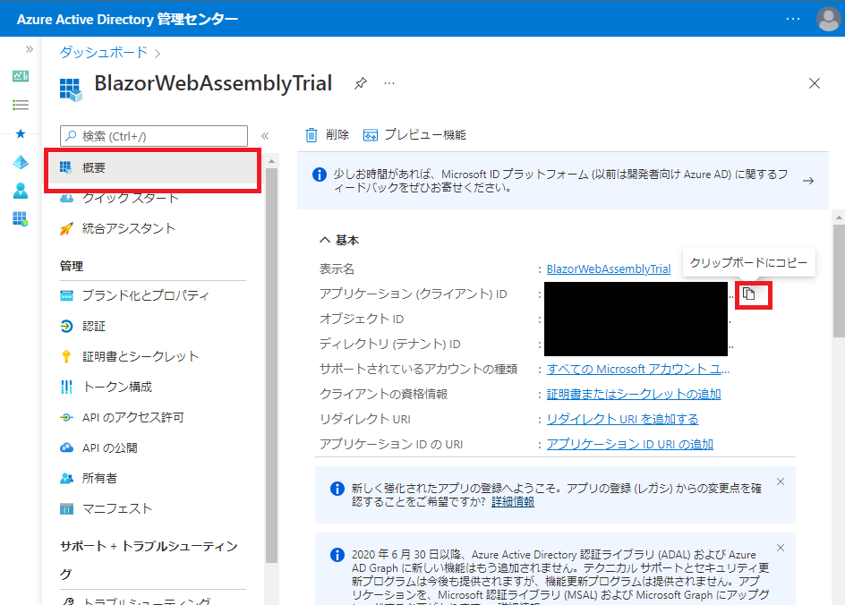
1. パブリッククライアントフローを許可し、保存する。  
   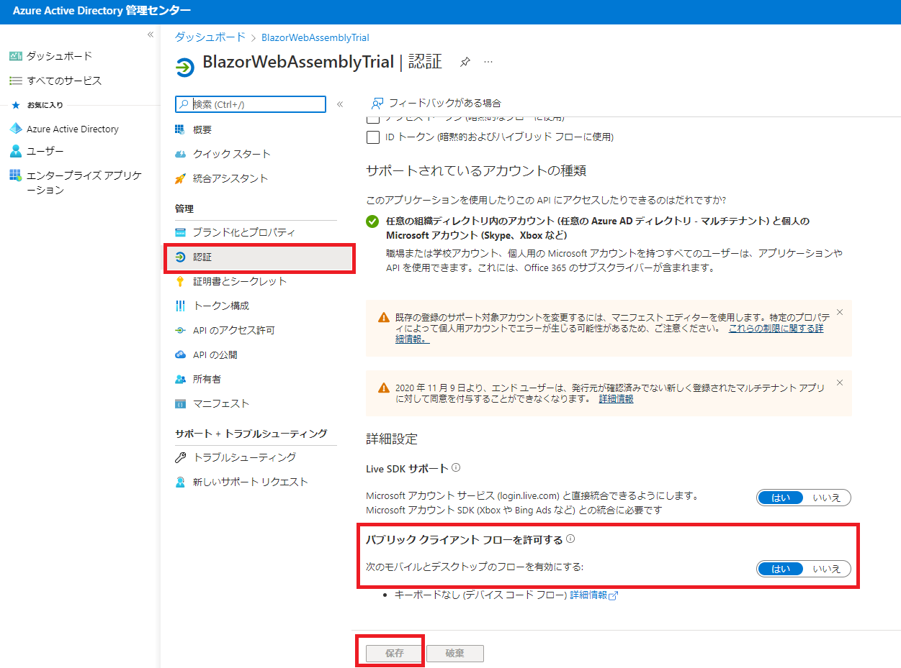
1. APIのアクセスを許可する。
   1. [APIのアクセス許可] -> [アクセス許可の追加] -> [Microsoft Graph] を選択する  
      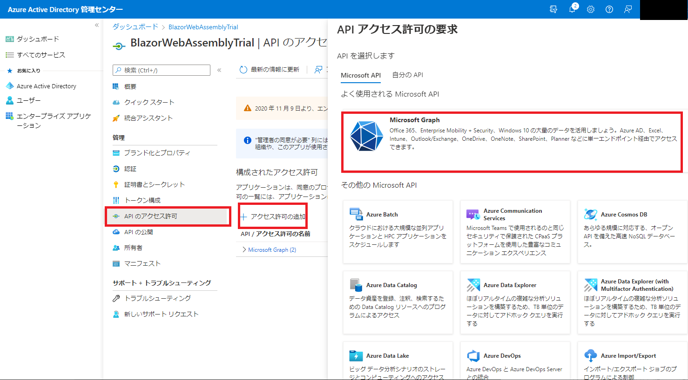
   1. [委任されたアクセス許可]を選択する  
      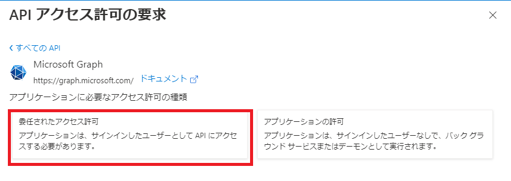
   1. `User.Read`と`Files.ReadWrite`を追加する  
      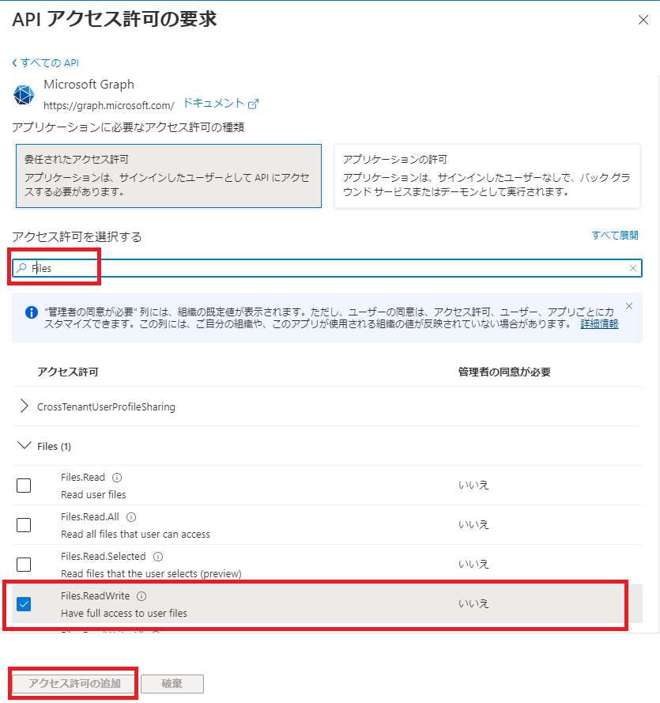

## Blazor WebAssemblyを実装する

ここから本題。

### プロジェクト作成

```powershell
dotnet new blazorwasm -au SingleOrg --client-id "{CLIENT ID}" --tenant-id "common" -o {APP NAME}
```

|プレースホルダー|Azure Active Directory Name  |例                                   |備考         |
|--------------|------------------------------|------------------------------------|-------------|
|APP NAME      |-                             |-                                   |任意のアプリ名|
|CLIENT ID     |アプリケーション(クライアント)ID|41451fa7-82d9-4673-8fa5-69eff5a761fd|上で控えたやつ |

### Nugetパッケージ[Microsoft.Graph]をプロジェクトに追加

```powershell
cd {APP NAME}.csprojがあるフォルダ
dotnet add package Microsoft.Graph
```

### openid と offline_access の DefaultAccessTokenScopes の MsalProviderOptions のペアを追加

Program.csにaddの2行を追加する

```csharp
builder.Services.AddMsalAuthentication(options =>
{
    builder.Configuration.Bind("AzureAd", options.ProviderOptions.Authentication);
    options.ProviderOptions.DefaultAccessTokenScopes.Add("openid");          // add
    options.ProviderOptions.DefaultAccessTokenScopes.Add("offline_access");  // add
});
```

### ログインできることを確認

1. `{APP NAME}.csproj`があるフォルダに移動して`dotnet run`を実行する。  
   以下が出力される。

   ```powershell
   Building...
   info: Microsoft.Hosting.Lifetime[14]
         Now listening on: https://localhost:7176
   info: Microsoft.Hosting.Lifetime[14]
         Now listening on: http://localhost:5013
   info: Microsoft.Hosting.Lifetime[0]
         Application started. Press Ctrl+C to shut down.
   info: Microsoft.Hosting.Lifetime[0]
         Hosting environment: Development
   info: Microsoft.Hosting.Lifetime[0]
         Content root path: C:\Users\r-h-0\source\rhirano0715\OneDriveReadWriteByBlazorWasm\OneDriveReadWriteByBlazorWasm
   ```

1. 上で控えたURLをブラウザで表示し、[リダイレクトURLを追加する]をクリックする。  
   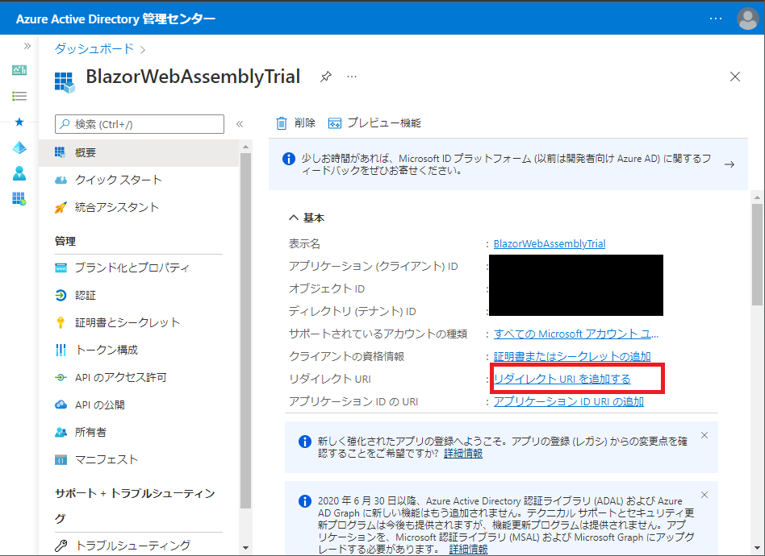

1. [プラットホームを追加]をクリックする。  
  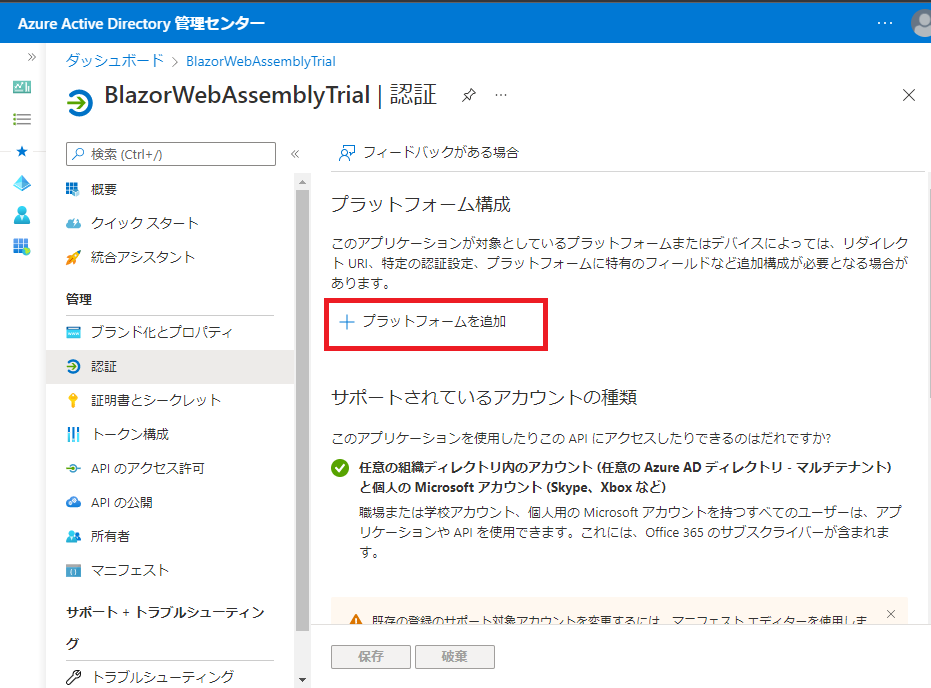

1. [シングルページアプリケーション]をクリックする。  
   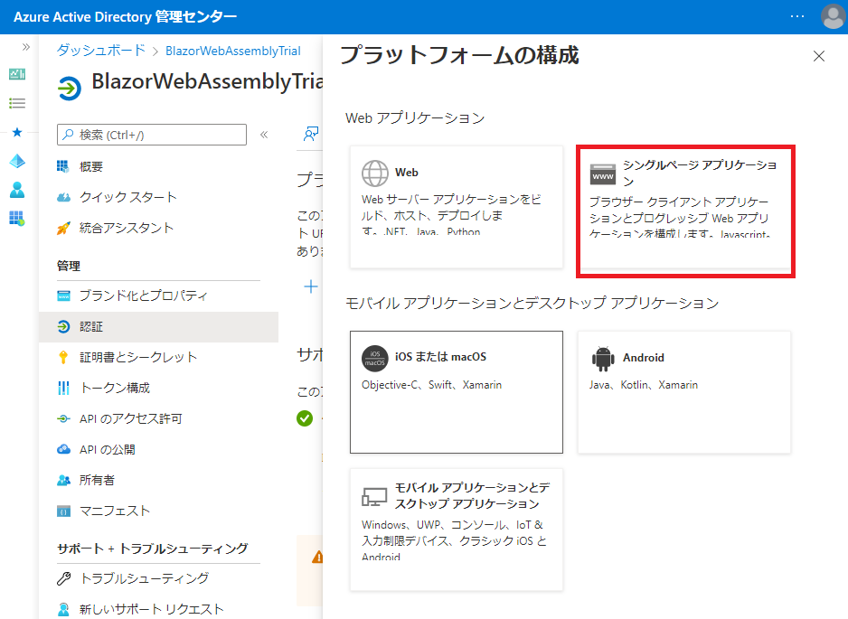

1. [リダイレクトURL]を入力し、[構成]をクリックする。  
   [リダイレクトURL]は`https://localhost:ポート番号/authentication/login-callback`とする。  
   ポート番号は`dotnet run`の最初に出るURLを参照。  
   上の例で言うと`https://localhost:7176`  
   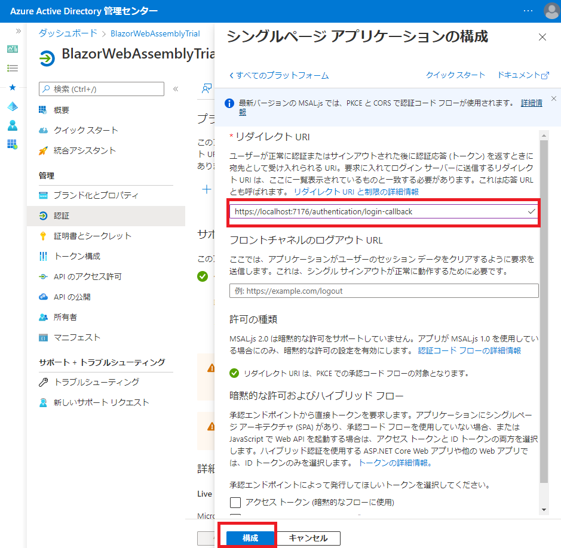

1. ブラウザで`dotnet run`の最初に出るURLを表示し、`Log in`をクリックする。  
   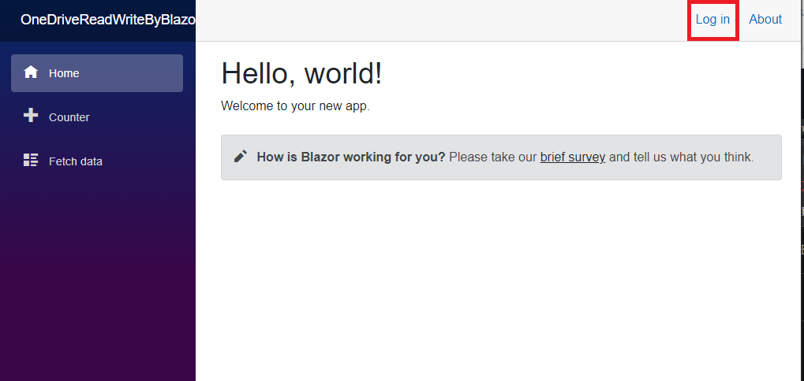

1. 以下が表示されたら、Microsoftアカウントにログインする。  
   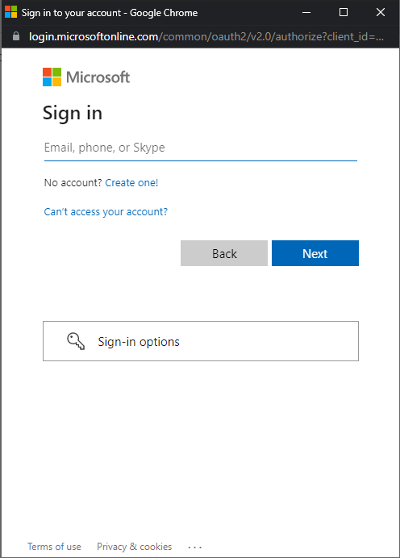

1. ログインできると、赤枠のところに"Hello 名前!"が表示される。  
   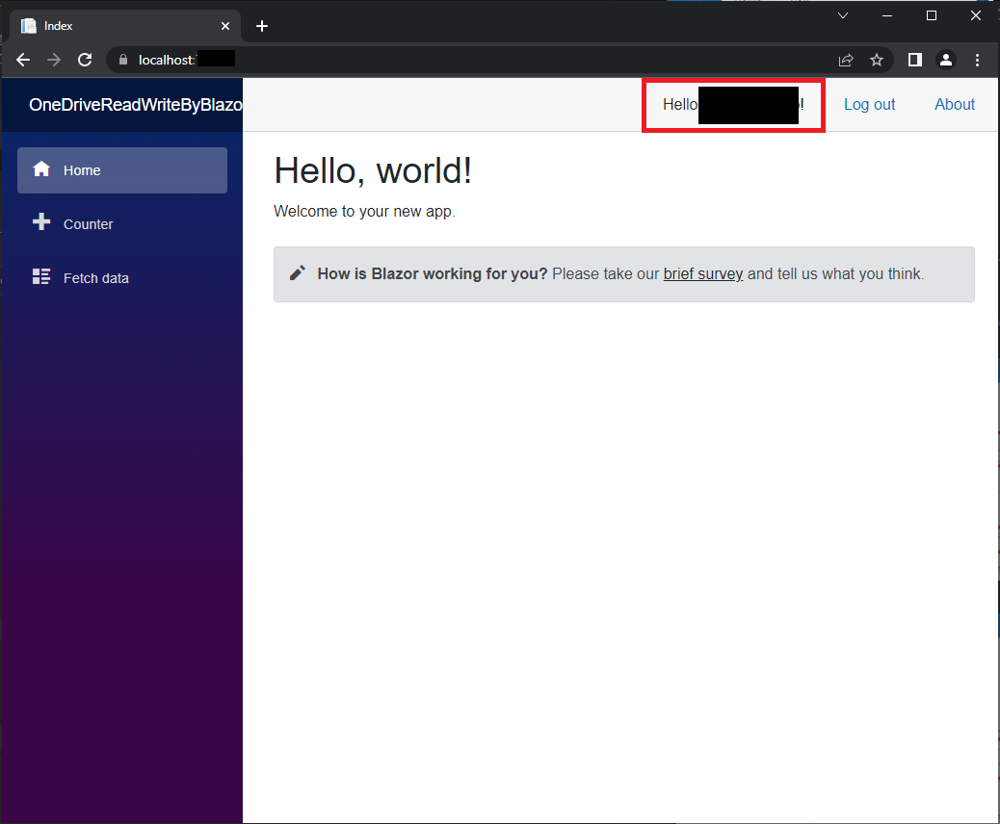

1. ログインできたことを確認したら、ブラウザを閉じる。

1. `dotnet run`を[Ctrl + C]で止める。

### Microsoft Graph APIを使用して、OneDriveを読み書き

1. Visual Studio 2022で`{APP NAME}.csproj`を開く。

1. プロジェクト直下に`GraphClientExtensions.cs`を追加し、以下のコードを書く。  

```csharp
namespace {APP NAME}
{
    using System;
    using System.Net.Http;
    using System.Net.Http.Headers;
    using System.Threading;
    using System.Threading.Tasks;
    using Microsoft.AspNetCore.Components.WebAssembly.Authentication;
    using Microsoft.Authentication.WebAssembly.Msal.Models;
    using Microsoft.Extensions.Configuration;
    using Microsoft.Extensions.DependencyInjection;
    using Microsoft.Graph;

    internal static class GraphClientExtensions
    {
        public static IServiceCollection AddGraphClient(
            this IServiceCollection services, params string[] scopes)
        {
            services.Configure<RemoteAuthenticationOptions<MsalProviderOptions>>(
                options =>
                {
                    foreach (var scope in scopes)
                    {
                        options.ProviderOptions.AdditionalScopesToConsent.Add(scope);
                    }
                });

            services.AddScoped<IAuthenticationProvider,
                NoOpGraphAuthenticationProvider>();
            services.AddScoped<IHttpProvider, HttpClientHttpProvider>(sp =>
                new HttpClientHttpProvider(new HttpClient()));
            services.AddScoped(sp =>
            {
                return new GraphServiceClient(
                    sp.GetRequiredService<IAuthenticationProvider>(),
                    sp.GetRequiredService<IHttpProvider>());
            });

            return services;
        }

        private class NoOpGraphAuthenticationProvider : IAuthenticationProvider
        {
            public NoOpGraphAuthenticationProvider(IAccessTokenProvider tokenProvider)
            {
                TokenProvider = tokenProvider;
            }

            public IAccessTokenProvider TokenProvider { get; }

            public async Task AuthenticateRequestAsync(HttpRequestMessage request)
            {
                var result = await TokenProvider.RequestAccessToken(
                    new AccessTokenRequestOptions()
                    {
                        Scopes = new[] {
                            "https://graph.microsoft.com/User.Read",
                            "https://graph.microsoft.com/Files.ReadWrite"
                        }
                    });

                if (result.TryGetToken(out var token))
                {
                    request.Headers.Authorization ??= new AuthenticationHeaderValue(
                        "Bearer", token.Value);
                }
            }
        }

        private class HttpClientHttpProvider : IHttpProvider
        {
            private readonly HttpClient http;

            public HttpClientHttpProvider(HttpClient http)
            {
                this.http = http;
            }

            public ISerializer Serializer { get; } = new Serializer();

            public TimeSpan OverallTimeout { get; set; } = TimeSpan.FromSeconds(300);

            public void Dispose()
            {
            }

            public Task<HttpResponseMessage> SendAsync(HttpRequestMessage request)
            {
                return http.SendAsync(request);
            }

            public Task<HttpResponseMessage> SendAsync(HttpRequestMessage request,
                HttpCompletionOption completionOption,
                CancellationToken cancellationToken)
            {
                return http.SendAsync(request, completionOption, cancellationToken);
            }
        }
    }
}
```

1. Program.csにaddの1行を追加する  

```csharp
builder.Services.AddMsalAuthentication(options =>
{
    builder.Configuration.Bind("AzureAd", options.ProviderOptions.Authentication);
    options.ProviderOptions.DefaultAccessTokenScopes.Add("openid");
    options.ProviderOptions.DefaultAccessTokenScopes.Add("offline_access");
});

// add
builder.Services.AddGraphClient("https://graph.microsoft.com/User.Read", "https://graph.microsoft.com/Files.ReadWrite");
```

1. `Pages/GraphExample.razor`を追加し、以下のコードを書く  

```csharp
@page "/GraphExample"
@using Microsoft.AspNetCore.Authorization
@using Microsoft.Graph
@using System.IO
@using System.Text
@attribute [Authorize]
@inject GraphServiceClient GraphClient

<h3>Graph Client Example</h3>

<h4>User infomation</h4>

@if (user != null)
{
    <p>DisplayName: @user.DisplayName</p>
    <p>UserPrincipalName: @user.UserPrincipalName</p>
}

<h4>Onedrive root items</h4>

@if (rootChildren != null)
{
    <table class="table">
        <thead>
            <tr>
                <th>Name</th>
            </tr>
        </thead>
        <tbody>
            @foreach (var rootChild in rootChildren)
            {
                <tr>
                    <td>@rootChild.Name</td>
                </tr>
            }
        </tbody>
    </table>
}

<h4>uploaded_by_graph_example</h4>
@if (lines != null)
{
    @foreach(var line in lines)
    {
        <p>@line</p>
    }
}


@code {
    private User? user;
    private IDriveItemChildrenCollectionPage? rootChildren;
    private List<string>? lines;

    protected override async Task OnInitializedAsync()
    {
        await this.InitializeUser();

        await this.PutFileToOneDrive();

        await this.InitializeItemList();

        await this.ReadTextFromOneDrive();
    }

    private async Task InitializeUser()
    {
        var request = GraphClient.Me.Request();
        user = await request.GetAsync();
    }

    private async Task PutFileToOneDrive()
    {
        await GraphClient.Me.Drive.Root
            .ItemWithPath("uploaded_by_graph_example.txt").Content
            .Request()
            .PutAsync<DriveItem>(new MemoryStream(Encoding.GetEncoding("UTF-8").GetBytes("line1\nline2\n行3\n")));
    }

    private async Task InitializeItemList()
    {
        rootChildren = await GraphClient.Me.Drive.Root.Children.Request().GetAsync();
    }

    private async Task ReadTextFromOneDrive()
    {
        var stream = await GraphClient.Me.Drive.Root
            .ItemWithPath("uploaded_by_graph_example.txt").Content
            .Request()
            .GetAsync();

        var ms = new MemoryStream();
        await stream.CopyToAsync(ms);
        var text = Encoding.GetEncoding("UTF-8").GetString(ms.ToArray());
        lines = text.Split('\n').ToList();
    }
}
```

1. {APP NAME}.csprojがあるフォルダに移動してdotnet runを実行し、ブラウザで`https://localhost:ポート番号/`を表示する。

1. [Log in]をクリックし、Microsoftアカウントにログインする。

   
   

1. ログインできると、赤枠のところに"Hello 名前!"が表示される。  
   

1. ブラウザで`https://localhost:ポート番号/GraphExample`を表示する。  
   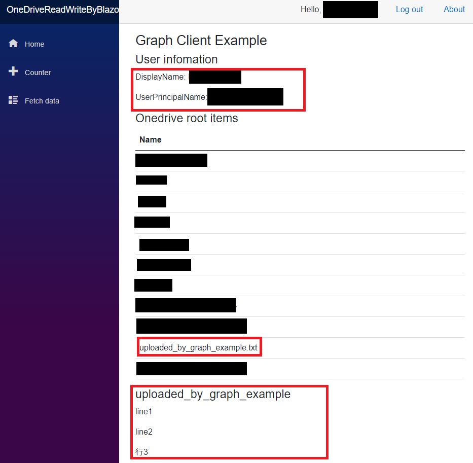  
   1. 上手くいっていれば、以下の動作をする。
      1. ユーザー情報(User infomation)が表示される。
      1. One Driveのルート直下にある要素一覧(Onedrive root items)が表示される。  
         書き込みができていれば、`uploaded_by_graph_example.txt`がある。
      1. 書き込んだファイルを読み込んだ結果(uploaded_by_graph_example)に書き込んだ文字列が表示される。
   1. 念のため、OneDriveを直接覗いてアップロードされていることを確認する。  
      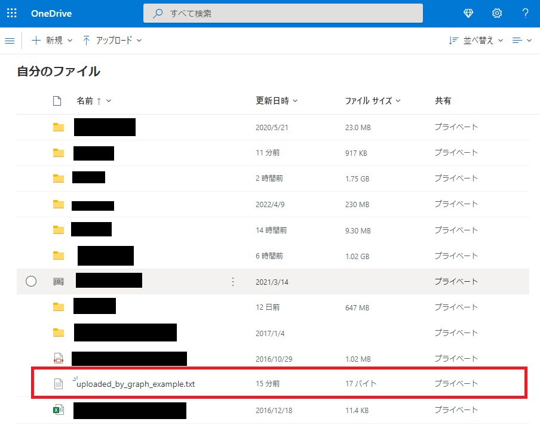
